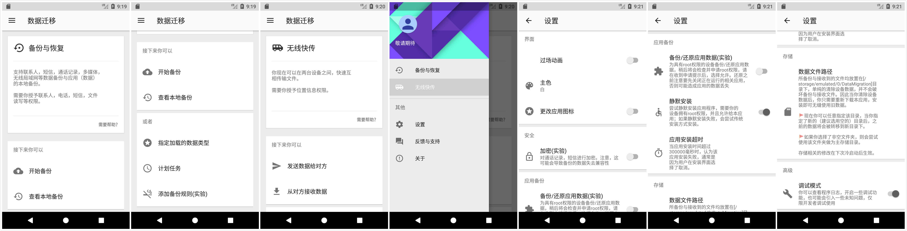
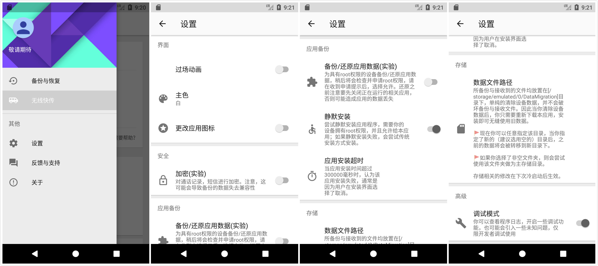

## 数据迁移OpenSource

## 部分截图





--------------

## 编译

[](https://travis-ci.org/Tornaco/DataMigration)

> 编译开始前
**wfdhook** 模块使用了一些android隐藏api，我们需要去 [Android-Hidden-API](https://github.com/anggrayudi/android-hidden-api) 或者 [24版本](https://github.com/Tornaco/Hidden-api-android-24)或者[百度网盘](http://pan.baidu.com/s/1dF6EcSx)下载隐藏版本sdk。

**简要步骤:**           
1. 下载上述sdk.
2. 进入 ```<SDK location>/platforms/```。
3. 用下载的版本的```android.jar```替换原来的jar, e.g. ```android-24/android.jar```。
4. 将本项目导入android studio编译或者使用gradle命令编译。

### 使用gradle命令编译:
```
./gradlew app:assembleDebug
```
--------------

## 应用模块以及介绍

### Vangogh：图片加载框架

一个简单流畅的的，具有以下feature的加载器：
1. 自定义的loader。
2. 自定义的动画 图形效果。
3. 自定义的Displayer。
4. 平滑，以及其他基本的参数定义。

令见：此模块单独的REPO：https://github.com/Tornaco/VanGogh


### EventBus:通讯模块

支持跨进程，支持@annotation的android事件总线通信模块。

令见，模块单独REPO：https://github.com/Tornaco/EventBus_Android

注：@NickAndroid是我的另一个废弃的github账户。

### Tiles

材料设计风格的设置项库，参见：https://github.com/Tornaco/MaterialTile_Android

注：@NickAndroid是我的另一个废弃的github账户。


--------------

## 应用核心组件

### 备份

* Loader 数据加载器。
* XXX


TBC
